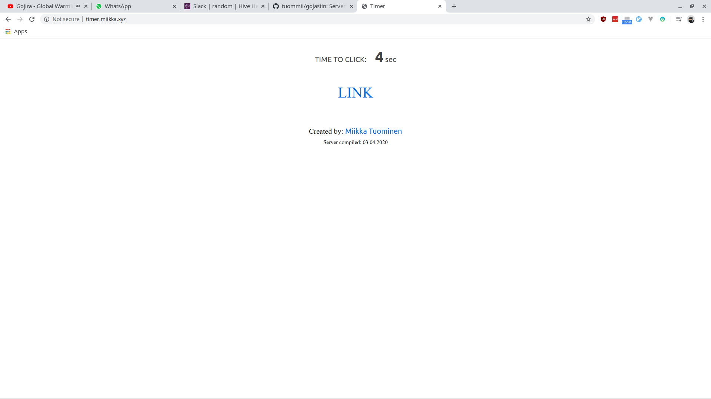

# gojastin

Gojastin is a server measuring times between requests. Live: http://timer.miikka.xyz/

Proof of Concept for [Remote challenge](https://github.com/hivehelsinki/remote-challs/tree/master/chall03)

Challenge was fun but server side seemed far more interesting so I decided try to do my own.

WIP.

## Run
`make`
